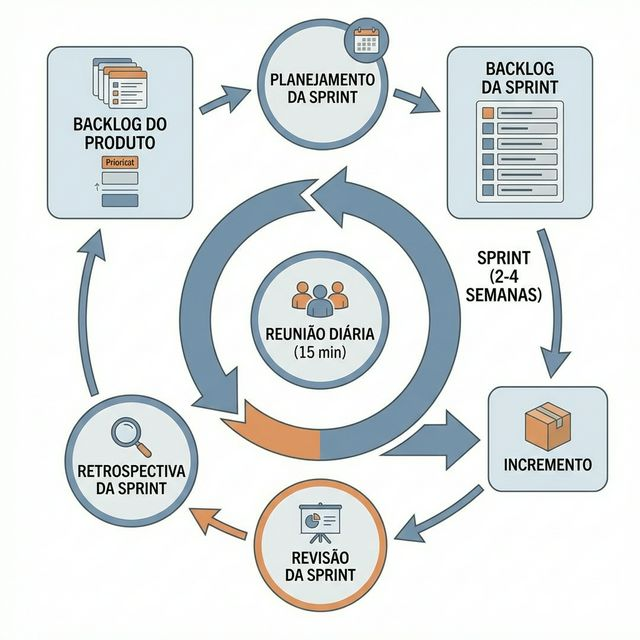

# Módulo 02: Scrum Framework

## Sumário
1. [Introdução](#introdução)
2. [Teoria e Pilares do Scrum](#teoria-e-pilares-do-scrum)
3. [Valores do Scrum](#valores-do-scrum)
4. [Papéis (Accountabilities)](#papéis-accountabilities)
5. [Artefatos](#artefatos)
6. [Eventos](#eventos)
7. [Referências](#referências)

## Introdução
O Scrum é o framework ágil mais utilizado no mundo. Ele não é uma metodologia completa ou preditiva, mas um framework leve que ajuda pessoas, times e organizações a gerar valor por meio de soluções adaptativas para problemas complexos.

## Teoria e Pilares do Scrum
O Scrum baseia-se no empirismo e no pensamento Lean. O empirismo afirma que o conhecimento vem da experiência e da tomada de decisão baseada no que é observado.

*(O ciclo completo do Scrum)*

Três pilares sustentam qualquer implementação de Scrum empírico:

1. **Transparência:** Os aspectos significativos do processo devem estar visíveis aos responsáveis pelos resultados. (Ex: O Quadro Kanban deve mostrar a verdade, não o que queremos ver).
2. **Inspeção:** Os artefatos e o progresso devem ser inspecionados frequentemente para detectar variações indesejadas. (Ex: A Daily Scrum serve para inspecionar o progresso da Sprint).
3. **Adaptação:** Se um aspecto do processo desvia fora dos limites aceitáveis, o processo ou o material sendo produzido deve ser ajustado o mais rápido possível. (Ex: A Retrospectiva serve para adaptar o processo).

## Valores do Scrum
O sucesso do Scrum depende de as pessoas se tornarem mais proficientes em viver cinco valores:

1.  **Compromisso:** As pessoas se comprometem pessoalmente a alcançar os objetivos do Time Scrum.
2.  **Foco:** Todos focam no trabalho da Sprint e nos objetivos do Time Scrum.
3.  **Abertura:** O Time Scrum e seus stakeholders concordam em ser abertos sobre o trabalho e os desafios.
4.  **Respeito:** Os membros do Time Scrum respeitam uns aos outros para serem pessoas capazes e independentes.
5.  **Coragem:** Os membros do Time Scrum têm coragem para fazer a coisa certa e trabalhar em problemas difíceis.

## Papéis (Accountabilities)
No Scrum Guide 2020, o termo "Papéis" foi atualizado para "Responsabilidades" (Accountabilities) para enfatizar a responsabilidade sobre o título.

*(As três responsabilidades do Scrum)*

1.  **Developers (Desenvolvedores):** As pessoas do Time Scrum que estão comprometidas em criar qualquer aspecto de um Incremento utilizável a cada Sprint. Não são apenas codificadores; podem ser designers, escritores, testadores, etc.
2.  **Product Owner (Dono do Produto):** Responsável por maximizar o valor do produto resultante do trabalho do Time Scrum. Ele gerencia o Product Backlog e expressa claramente os itens. É *uma* pessoa, não um comitê.
3.  **Scrum Master:** Responsável por estabelecer o Scrum conforme definido no Scrum Guide. Eles fazem isso ajudando a todos a entender a teoria e a prática do Scrum. Servem ao Time, ao PO e à Organização.

**Exercício 2:** Quem é a ÚNICA pessoa responsável por cancelar uma Sprint se o Objetivo da Sprint se tornar obsoleto?
a) O Scrum Master.
b) O Gerente de Projetos.
c) O Product Owner.
d) O CEO da empresa.

Ver Resposta

**Resposta:** c) O Product Owner.

**Explicação:** Apenas o Product Owner tem a autoridade para cancelar a Sprint. Influências externas ou do time podem aconselhá-lo, mas a decisão final é dele, pois ele é responsável pelo valor do produto.

## Artefatos
Os artefatos do Scrum representam trabalho ou valor. Eles são projetados para maximizar a transparência.

1.  **Product Backlog:** Uma lista ordenada e emergente do que é necessário para melhorar o produto. Fonte única de trabalho.
2.  **Sprint Backlog:** O conjunto de itens do Product Backlog selecionados para a Sprint, mais um plano para entregar o Incremento e o Objetivo da Sprint.
3.  **Incremento:** O trampolim para o Objetivo do Produto. É a soma de todos os itens do Backlog completados durante a Sprint e o valor dos incrementos de todas as Sprints anteriores. Deve ser "Done" (Feito).

## Eventos
Os eventos são time-boxed (têm duração máxima fixa).

1.  **Sprint:** O coração do Scrum. Um container para todos os outros eventos. Duração fixa de um mês ou menos (geralmente 2 semanas).
2.  **Sprint Planning:** Define o que pode ser entregue na Sprint e como o trabalho será realizado.
3.  **Daily Scrum:** Evento de 15 minutos para os Developers inspecionarem o progresso em direção ao Objetivo da Sprint e adaptarem o Sprint Backlog.
4.  **Sprint Review:** Inspecionar o resultado da Sprint e determinar futuras adaptações. O Time Scrum apresenta o trabalho para os stakeholders.
5.  **Sprint Retrospective:** O Time Scrum inspeciona a si mesmo (processos, ferramentas, relações) e cria um plano de melhorias para a próxima Sprint.

**Exercício 2.1:** Qual é o objetivo principal da Daily Scrum?
a) Reportar status para o Product Owner e Scrum Master.
b) Inspecionar o progresso em direção ao Objetivo da Sprint e adaptar o planejamento das próximas 24 horas.
c) Resolver problemas técnicos complexos que surgiram no dia anterior.
d) Atualizar o cronograma do projeto no Jira.

Ver Resposta

**Resposta:** b) Inspecionar o progresso em direção ao Objetivo da Sprint e adaptar o planejamento das próximas 24 horas.

**Explicação:** A Daily Scrum é um evento de planejamento para os Developers. Não é uma reunião de status report para a gestão. Problemas complexos podem ser identificados, mas devem ser resolvidos *após* a reunião para respeitar o time-box de 15 minutos.

## Referências

[1] Schwaber, K. & Sutherland, J. O Guia do Scrum. Disponível em: [https://scrumguides.org/download.html](https://scrumguides.org/download.html)
[2] Scrum.org. What is Scrum? Disponível em: [https://www.scrum.org/resources/what-is-scrum](https://www.scrum.org/resources/what-is-scrum)

[Próximo módulo →](../teoria/modulo_03_metodo_kanban.md)

[Voltar aos Links Rápidos](../README.md#links-rapidos)
