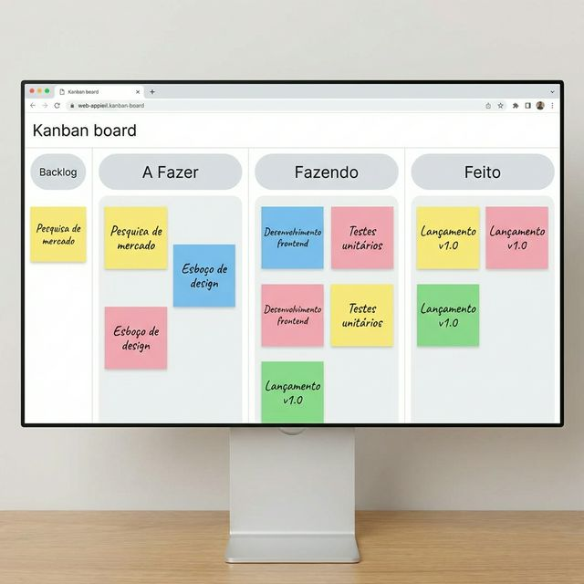
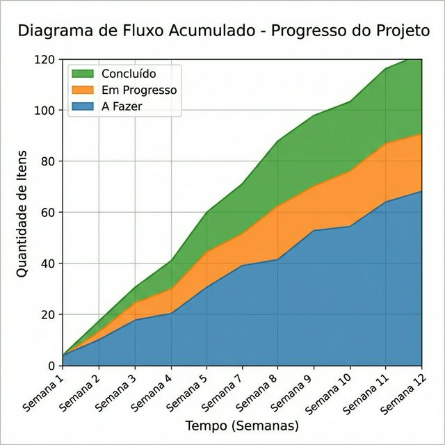

# Módulo 03: Método Kanban

## Sumário
1. [Introdução](#introdução)
2. [Princípios Básicos](#princípios-básicos)
3. [Práticas Gerais](#práticas-gerais)
4. [Métricas de Fluxo](#métricas-de-fluxo)
5. [Referências](#referências)

## Introdução
Kanban é uma palavra japonesa que significa "sinal visual" ou "cartão". Originalmente parte do Sistema Toyota de Produção, foi adaptado para o trabalho do conhecimento por David J. Anderson. Ao contrário do Scrum, o Kanban não prescreve papéis ou eventos fixos, mas sim uma gestão evolutiva do fluxo de trabalho.

## Princípios Básicos
O método Kanban possui dois grupos de princípios:

### Princípios de Gestão de Mudança
1.  **Comece com o que você faz agora:** Não mude tudo de uma vez. O Kanban respeita os processos, papéis e responsabilidades atuais para reduzir a resistência à mudança.
2.  **Busque mudanças incrementais e evolutivas:** Pequenas melhorias contínuas (Kaizen) são mais sustentáveis do que grandes re estruturações.
3.  **Incentive atos de liderança em todos os níveis:** Qualquer pessoa pode sugerir melhorias, não apenas gestores.

### Princípios de Entrega de Serviços
1.  **Foco nas necessidades do cliente:** Entenda o que o cliente espera.
2.  **Gerencie o trabalho, não as pessoas:** Deixe as pessoas se auto-organizarem em torno do trabalho visível.
3.  **Evolua políticas para melhorar os resultados:** Torne as regras explícitas para que possam ser melhoradas.

## Práticas Gerais
Existem 6 práticas fundamentais no Kanban:

1.  **Visualizar o Fluxo de Trabalho:** Crie um modelo visual do processo (quadro). Se você não vê, não consegue gerenciar.

*(Exemplo de um quadro com colunas A Fazer, Fazendo e Feito)*

2.  **Limitar o Trabalho em Progresso (WIP):** WIP (Work In Progress) é o assassino da produtividade. Pare de começar e comece a terminar. Limitar o WIP força o foco e expõe gargalos.
3.  **Gerenciar o Fluxo:** O objetivo é fazer o trabalho fluir suave e rapidamente pelo sistema.
4.  **Tornar as Políticas Explícitas:** Defina claramente o que significa "Pronto" em cada etapa. Quando todos entendem as regras, a colaboração melhora.
5.  **Implementar Ciclos de Feedback:** Reuniões de revisão de fluxo, estratégia e operações para inspecionar e adaptar.
6.  **Melhorar Colaborativamente, Evoluir Experimentalmente:** Use o método científico para propor mudanças.

**Exercício 3:** O que acontece quando você reduz o limite de WIP (Trabalho em Progresso) em uma etapa do fluxo?

a) A equipe fica ociosa e desmotivada.

b) O tempo de entrega (Lead Time) tende a diminuir e os gargalos se tornam visíveis.

c) A qualidade do produto cai porque as pessoas trabalham com pressa.

d) O cliente fica insatisfeito porque menos tarefas são iniciadas ao mesmo tempo.

Ver Resposta

**Resposta:** b) O tempo de entrega (Lead Time) tende a diminuir e os gargalos se tornam visíveis.

**Explicação:** A Lei de Little prova que, para um sistema estável, quanto menor o WIP, menor o Lead Time (tempo de ciclo). Focar em terminar poucas coisas é mais rápido do que tentar fazer muitas ao mesmo tempo (multitarefa).

## Métricas de Fluxo
O Kanban é fortemente baseado em dados.

1.  **Lead Time:** O tempo total desde que a demanda é solicitada pelo cliente até ser entregue.
2.  **Cycle Time:** O tempo em que a equipe efetivamente trabalha na demanda (início do trabalho até a entrega).
3.  **Throughput (Vazão):** Quantidade de itens entregues em um período de tempo (ex: 5 cartões por semana).
4.  **Cumulative Flow Diagram (CFD):** Um gráfico poderoso que mostra a estabilidade do fluxo, gargalos e tendências de WIP.

*(O Diagrama de Fluxo Cumulativo mostra a saúde do processo)*

**Exercício 3.1:** Se a sua Vazão média é de 2 tarefas por dia e você tem 10 tarefas na fila de "A Fazer", qual é a previsão aproximada para terminar essas tarefas (ignorando novas entradas)?

a) 2 dias.

b) 5 dias.

c) 10 dias.

d) Impossível prever.

Ver Resposta

**Resposta:** b) 5 dias.

**Explicação:** Esta é uma aplicação simples da Lei de Little. Se saem 2 tarefas por dia, levará 5 dias para limpar uma fila de 10 (10 / 2 = 5). No gerenciamento de fluxo, usamos o histórico de vazão para fazer previsões probabilísticas.

## Referências

[1] Anderson, D. J. Kanban: Successful Evolutionary Change for Your Technology Business. Blue Hole Press, 2010.
[2] Kanban University. The Official Guide to the Kanban Method. Disponível em: [https://kanban.university/kanban-guide/](https://kanban.university/kanban-guide/)

[Próximo módulo →](../teoria/modulo_04_extreme_programming_xp.md)

[Voltar aos Links Rápidos](../README.md#links-rapidos)
