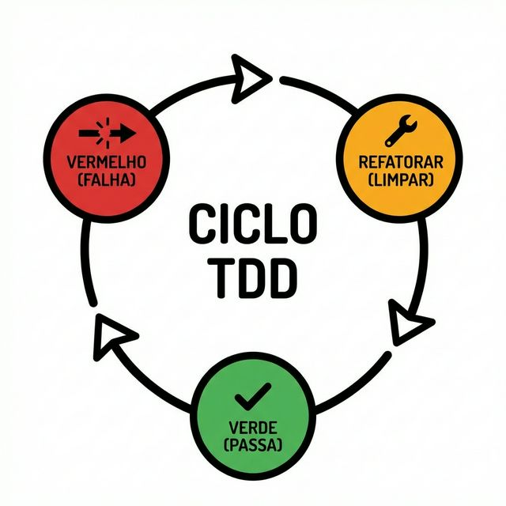

# Módulo 04: Extreme Programming (XP)

## Sumário
1. [Introdução](#introdução)
2. [Os 5 Valores do XP](#os-5-valores-do-xp)
3. [Práticas de Engenharia](#práticas-de-engenharia)
4. [O Jogo do Planejamento](#o-jogo-do-planejamento)
5. [Referências](#referências)

## Introdução
O Extreme Programming (XP), criado por Kent Beck em 1996, é uma metodologia ágil focada na excelência técnica e na qualidade do software. Enquanto o Scrum foca na gestão do processo, o XP foca nas práticas de engenharia: *como* o software é construído. O nome vem da ideia de levar as boas práticas de desenvolvimento ao extremo. Se revisão de código é bom, faremos isso o tempo todo (Pair Programming). Se testar é bom, testaremos antes de codificar (TDD).

## Os 5 Valores do XP
Os valores guiam as decisões em um time XP.

*(Os 5 valores fundamentais do XP)*

1.  **Comunicação:** Construir sistemas requer comunicar requisitos do sistema para os desenvolvedores. Em XP, prefere-se conversas diretas a documentos.
2.  **Simplicidade:** Aposte na solução mais simples que poderia funcionar ("Do The Simplest Thing That Could Possibly Work"). Evite super-engenharia.
3.  **Feedback:** Feedback rápido através de testes unitários e ciclos curtos. Se algo está errado, queremos saber em minutos, não meses.
4.  **Coragem:** Coragem para refatorar código que funciona mas está mal escrito, coragem para jogar fora código desnecessário e para ser transparente sobre o progresso.
5.  **Respeito:** Os membros da equipe respeitam o trabalho uns dos outros e não comitam código que quebre a build.

## Práticas de Engenharia
O XP introduziu muitas das práticas que hoje são padrão na indústria.

### Test-Driven Development (TDD)
Escreva o teste antes do código.
1.  **Red:** Escreva um teste que falha.
2.  **Green:** Escreva o código mínimo para passar no teste.
3.  **Refactor:** Melhore o código sem alterar o comportamento (mantendo o teste verde).

*(O ciclo Red-Green-Refactor)*

### Pair Programming (Programação em Par)
Dois programadores, um computador.
*   **Piloto:** Digita o código.
*   **Copiloto:** Revisa em tempo real, pensa na estratégia e nos casos de borda.
*   Os papéis trocam frequentemente. Aumenta a qualidade e difunde o conhecimento.

### Refactoring (Refatoração)
Melhorar a estrutura interna do código sem alterar seu comportamento externo. O código deve ser mantido limpo e legível continuamente, não apenas no final do projeto.

### Continuous Integration (CI)
Integrar e testar o código várias vezes ao dia. Isso evita o "inferno da integração" que ocorre quando times ficam semanas trabalhando isolados.

## O Jogo do Planejamento
O Planejamento no XP é um diálogo contínuo entre Negócios e Desenvolvimento.
*   **User Stories:** Negócios escrevem o que precisam em cartões (Histórias de Usuário).
*   **Release Planning:** Planejamento de longo prazo (meses) definindo quais histórias entram em qual release.
*   **Iteration Planning:** Planejamento de curto prazo (semanas) onde os desenvolvedores quebram as histórias em tarefas.

**Exercício 4:** No TDD, o que você deve fazer imediatamente após escrever um teste que falha (passo Red)?
a) Refatorar o código existente.
b) Escrever o código completo da funcionalidade com todos os detalhes e tratamentos de erro.
c) Escrever apenas o código mínimo e necessário para fazer o teste passar.
d) Escrever mais testes para outros casos de uso.

Ver Resposta

**Resposta:** c) Escrever apenas o código mínimo e necessário para fazer o teste passar.

**Explicação:** O TDD prega o passo mais simples. Se você escrever mais do que o necessário para passar no teste, estará escrevendo código não testado ou desnecessário. A elegância vem no passo seguinte (Refactor).

## Referências

[1] Beck, K. Extreme Programming Explained: Embrace Change. Addison-Wesley, 1999.
[2] Fowler, M. Refactoring: Improving the Design of Existing Code. Addison-Wesley, 1999.

[Próximo módulo →](../teoria/modulo_05_lean_software_development.md)

[Voltar aos Links Rápidos](../README.md#links-rapidos)
