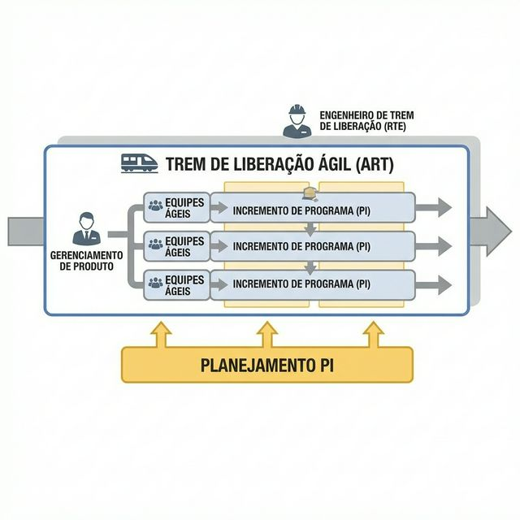

# Módulo 07: Agilidade em Escala

## Sumário
1. [Introdução](#introdução)
2. [Scaled Agile Framework (SAFe)](#scaled-agile-framework-safe)
3. [LeSS (Large-Scale Scrum)](#less-large-scale-scrum)
4. [Nexus](#nexus)
5. [Referências](#referências)

## Introdução
"Scrum é fácil de entender, mas difícil de dominar." A dificuldade aumenta exponencialmente quando temos não apenas um time de 7 pessoas, mas 10, 50 ou 100 times trabalhando no mesmo produto. Como alinhar todos sem criar uma burocracia paralisante? É aqui que entram os frameworks de escala.

## Scaled Agile Framework (SAFe)
O SAFe é o framework mais popular para grandes empresas. Ele fornece uma base de conhecimento estruturada para escalar o Agile.

### Agile Release Train (ART)
O coração do SAFe é o ART: um time de times ágeis (50-125 pessoas) que planeja, comita e executa junto. É como um trem virtual que nunca para.

### PI Planning (Program Increment Planning)
Um evento presencial (ou virtual) massivo, de 2 dias, onde todos os membros do ART se reúnem para planejar as próximas 8-12 semanas de trabalho. É o alinhamento definitivo.

*(A configuração essencial do SAFe mostrando o ART)*

## LeSS (Large-Scale Scrum)
"LeSS é Scrum, aplicado a muitos times trabalhando juntos em um produto".
Ao contrário do SAFe, que adiciona papéis e processos, o LeSS tenta simplificar (Less is More).

*   **1 Product Owner** para todos os times (até 8 times).
*   **1 Product Backlog** para todos os times.
*   Times focados em funcionalidades "pontas a ponta".
*   Sprint Planning conjunto (parte 1) e revisões conjuntas.

## Nexus
Criado pela Scrum.org (Ken Schwaber), o Nexus também é baseado no Scrum. Seu foco principal é gerenciar **dependências** cruzadas entre times.

*   **Nexus Integration Team (NIT):** Um time especial responsável não por "fazer" o trabalho de integração, mas por garantir que o incremento integrado esteja pronto.
*   Adiciona eventos como o "Nexus Daily Scrum" para alinhar problemas de integração antes das Dailies individuais.

**Exercício 7:** Qual é a principal diferença filosófica entre SAFe e LeSS?

a) O SAFe é para startups e o LeSS para governos.

b) O SAFe fornece uma estrutura robusta e prescritiva para coordenar grandes corporações, enquanto o LeSS busca manter a simplicidade do Scrum removendo complexidade organizacional.

c) O SAFe usa Kanban e o LeSS usa XP.

d) Não há diferença, apenas o nome muda.

Ver Resposta

**Resposta:** b) O SAFe fornece uma estrutura robusta e prescritiva... enquanto o LeSS busca manter a simplicidade...

**Explicação:** O SAFe é frequentemente criticado por ser "pesado" (muitos papéis), mas amado por grandes empresas por dar segurança. O LeSS é radical na "desscaling" (des-escalada), removendo cargos de coordenação intermediária para dar autonomia aos times.

## Referências

[1] Scaled Agile, Inc. SAFe 6.0 Framework. Disponível em: [https://scaledagileframework.com/](https://scaledagileframework.com/)
[2] The LeSS Company. Large-Scale Scrum (LeSS). Disponível em: [https://less.works/](https://less.works/)
[3] Scrum.org. The Nexus Guide. Disponível em: [https://www.scrum.org/resources/nexus-guide](https://www.scrum.org/resources/nexus-guide)

[Próximo módulo →](../teoria/modulo_08_metricas_e_melhoria_continua.md)

[Voltar aos Links Rápidos](../README.md#links-rapidos)
